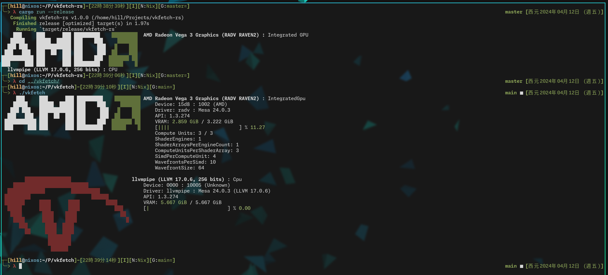

this is a rewrite of https://github.com/Wunkolo/vkfetch \
I referenced the code and took some of the ASCII art from it \
thanks to wunkolo for writing the original <3, love you buddy \
I rewrote it because I wanted to have vkfetch on an easy to manage package manager

# Goals
- [ ] support all the features of the original vkfetch
- [ ] support other gpus/vendors that aren't part of the original vkfetch
- [ ] use ANSI escape codes that are compatible with all terminals
- [ ] add background to ASCII art so single color logos can be seen on terminals where the background is the same colour

# vkfetch-rs

<!-- you can install this with cargo

```sh
cargo install vkfetch-rs
``` -->

## build it from source (you need to have some libraries installed)

```sh
git clone https://github.com/float3/vkfetch-rs
cd vkfetch-rs
cargo build
```

# current progress (comparison with original vkfetch)

